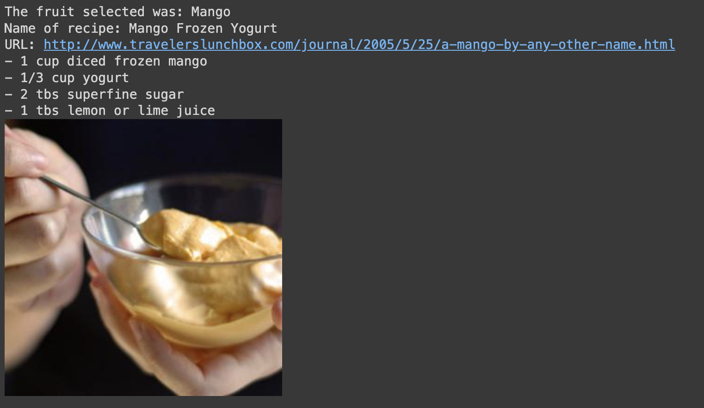

<h1>Assignment 1: Data Feature</h1>

<h2>Description:</h2>
This Google Collab notebook demonstrates a data feature combining data from 2 APIs: Edamam Recipes, an API designed to provide recipes based on user selected parameters, and FruityVice, an API that provides a range of known fruits and data related to them. The idea of this project is to help people find recipes that contain their desired fruit ingredients.

<h2>Details</h2>
<ul>
<li>Recipes are provided with their URI, name, ingredients and image.
<li>The basic implementation shown in current code provides a random fruit each time the code is compiled.
<li>The code will display a Pandas DataFrame containing all recipes that contain the current fruit selected.
</ul>

<h2>Implementation</h2>
First, we decided to utilize the two APIs mentioned because there was an opportunity to relate the vast food data provided by Edamam and FruityVice.
 
Following this idea, we requested the API keys for Edamam by creating an account. With the account ID and key, we were able to access the data. Once obtained, we accessed the FruityVice API to provide a list of all fruits in the database.
 
Finally, we chose a random fruit and sent it as a parameter for the search inside the Edamam recipe search, which returned all recipes associated (searches in recipe name & tags linked to the recipe).

<h2>API details</h2>
<ul>
<li><strong>Edamam:</strong> Developer account required. Limit -> 10 requests per minute.
<a src="https://developer.edamam.com/edamam-docs-recipe-api">https://developer.edamam.com/edamam-docs-recipe-api</a>
<li><strong>FruityVice:</strong> No account/auth required. No limit specified.
<a src="https://www.fruityvice.com/doc/index.html">https://www.fruityvice.com/doc/index.html</a>
</ul>

<h2>Execution:</h2>
Run the notebook as displayed in GitHub. Keys are provided. For custom searches, change the parameters of the <strong>get_recipe</strong> function: 
 
<code>
params = {"type": "public", "app_id": *APP ID*,"app_key":*API KEY*,"q":<strong>fruit</strong>} 
</code>  
Change the "fruit" variable into a string of your preferred fruit/ingredient. For example:   
<code>params = {"type": "public", "app_id": *APP ID*,"app_key":*API KEY*,"q":<strong>"apple"</strong>}</code>
 
 

